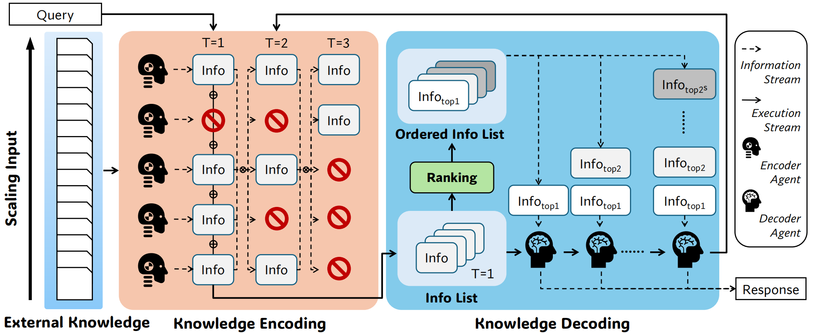

# ExtAgents

## Introduction

ExtAgents is a framework for scaling external knowledge input beyond the context length of LLMs via multi-agent collaboration.



## Setup

```bash
conda create -n extagents python=3.10 -y
conda activate extagents
pip install -r requirements.txt
```

## Data

You can download the data with the script:

```bash
bash scripts/download_data.sh
```

Or you can download the data manually from one of the following links:

- [Google Drive](https://drive.google.com/drive/folders/1FQSojqgF1VdumXxSh1UbIoE6lQ2E_xJn?usp=sharing)
- [Tsinghua Cloud](https://cloud.tsinghua.edu.cn/d/b8aab568cf5c4785b457/)

The data should be organized as follows:

```bash
./
└── data/
    ├── sampled_hotpot_questions.json
    ├── rag_1000k.jsonl
    ├── longbook_qa_eng.jsonl
    └── longbook_qa_chn.jsonl
```

## Usage

### Generation

We currently support three tasks: RAG, En.QA, Zh.QA.

The RAG task is a question answering task, where the input is a question and a context. The question and answer are sampled from the [HotpotQA](https://github.com/hotpotqa/hotpot). The context is a long text, which is the concatenation of documents retrieved from Wikipedia using BM25 embedding. We use [KILT knowledge source](http://dl.fbaipublicfiles.com/KILT/kilt_knowledgesource.json) as our knowledge source. It is based on the [2019/08/01 Wikipedia dump](http://dl.fbaipublicfiles.com/BLINK/enwiki-pages-articles.xml.bz2). We have provided the context in the `data/rag_1000k.jsonl` file.

The En.QA and Zh.QA tasks are question answering tasks, where the input is a question and a context. The question, answer and context are from the [InfiniteBench](https://github.com/OpenBMB/InfiniteBench).

Here is an example command to generate predictions for RAG task:

```bash
python main.py \
    --task rag \
    --output_dir results_rag \
    --chunk_length 8000 \
    --input_length 128000 \
    --api_url "YOUR_API_URL" \
    --api_key "YOUR_API_KEY" \
    --model "gpt-4o-mini-2024-07-18" \
    --num_workers 8 \
    > rag.log
```

The generated predictions will be saved in the `results_rag` directory.

- `--task`: Task, can be `rag`, `en`, `zh`.
- `--output_dir`: Directory to save the generated predictions.
- `--chunk_length`: Chunk length.
- `--input_length`: Input length.
- `--model`: Model to use, default is `gpt-4o-mini-2024-07-18`.
- `--api_url`: Your API URL, default is os.getenv("OPENAI_BASE_URL").
- `--api_key`: Your API Key, default is os.getenv("OPENAI_API_KEY").
- `--num_workers`: Number of workers, each worker will process one example.

You can also set the environment variables `OPENAI_BASE_URL` and `OPENAI_API_KEY` to avoid typing them in the command line.

```bash
export OPENAI_BASE_URL="YOUR_API_URL"
export OPENAI_API_KEY="YOUR_API_KEY"
```

### Evaluation

We provide a script to evaluate the generated predictions. For RAG task, the evaluation is based on the [HotpotQA](https://github.com/hotpotqa/hotpot). For En.QA and Zh.QA task, the evaluation is based on the [InfiniteBench](https://github.com/OpenBMB/InfiniteBench).

For RAG task:

```bash
bash scripts/eval_rag.sh /path/to/your/output_dir
```

For En.QA task: 

```bash
bash scripts/eval_en.sh /path/to/your/output_dir
```

For Zh.QA task:

```bash
bash scripts/eval_zh.sh /path/to/your/output_dir
```

## Citation

If you find this project helpful, please cite it as follows:

```bibtex
@article{liu2025extagents,
  title={Scaling External Knowledge Input Beyond The Context Length of LLMs via Multi-Agent Collaboration},
  author={Zijun Liu and Zhennan Wan and Peng Li and Ming Yan and Ji Zhang and Fei Huang and Yang Liu},
  year={2025}
}
```
